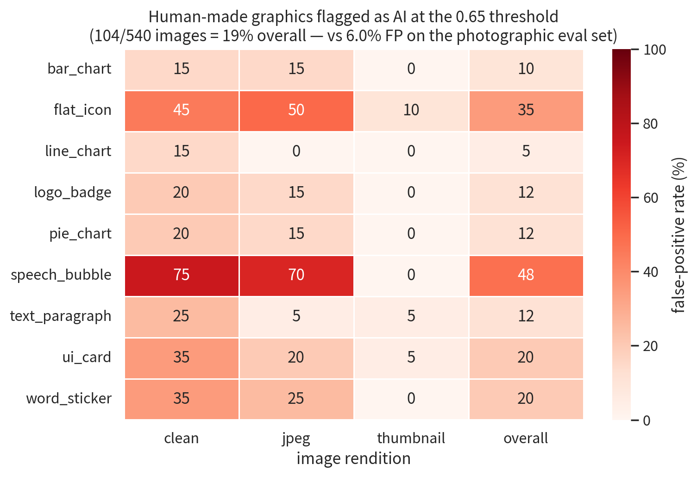
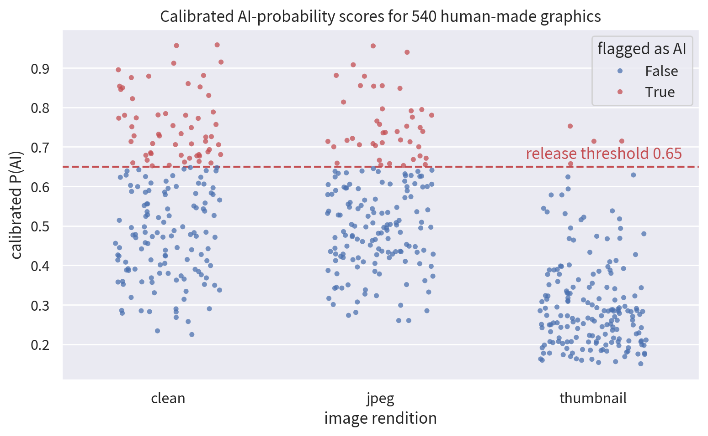
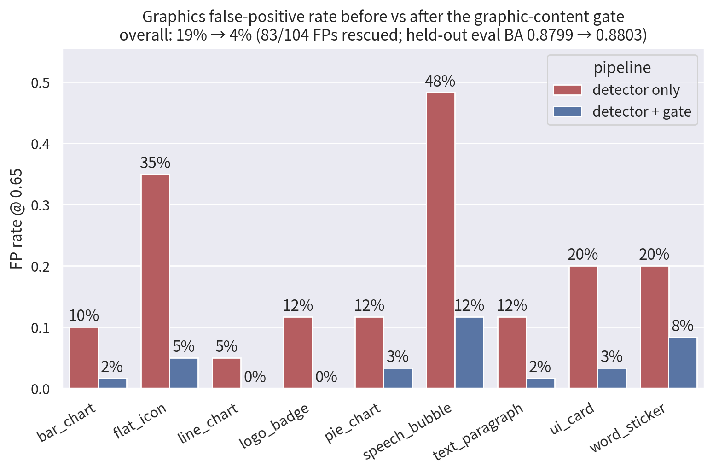

# Graphics false-positive report

Run date: 2026-08-14. Verdict: **FAIL on graphics content — 19.3% of human-made
graphics are badged as AI at the release threshold**, vs 6.0% on the
photographic eval set. With the shipped graphic-content gate active the rate
drops to **3.9%**, at zero measured cost on the held-out eval split.

This report quantifies the graphics slice of the false-positive problem at the
*shipped* operating point. It complements
[`NUISANCE_BATTERY_REPORT.md`](NUISANCE_BATTERY_REPORT.md), which fails the
release under its native-format protocol; here the same conclusion falls out
of the official-center pipeline alone, on content we own outright.

Motivation: image-search engines currently badge a visible share of ordinary
clip art as AI — stock vector numbers, kids' app icons, decade-old
illustrations. This report measures whether *this* detector, at its frozen
threshold, reproduces that failure class and where it concentrates.

## Frozen contract

| Field         | Value                                                                                                                                                                                       |
| ------------- | ------------------------------------------------------------------------------------------------------------------------------------------------------------------------------------------- |
| Corpus        | `data/nuisance-graphics/` — 540 human-authored graphics (9 categories × 20 source clusters × 3 renditions), all label 0, rendered locally with PIL by `tools/generate_graphics_nuisance.py` |
| Model         | Community Forensics dynamic INT8, SHA-256 `df1aade56566b892178154793bfa95cf5808339d77593ec8137e7c5e306f2035`                                                                                |
| Preprocessing | `official_center` (resize 440 → center crop 384), `tools/score_dataset.py`                                                                                                                  |
| Calibration   | `models/calibration/fused.json` (`cf384-browser-official-center-pooled-webrealistic-v2`), 64-knot monotone interpolation                                                                    |
| Decision rule | calibrated score ≥ **0.65** (release-fixed)                                                                                                                                                 |
| Scored rows   | `data/nuisance-graphics/scored-int8-official-center.csv`                                                                                                                                    |

## Results

### Headline

| <br />                                        |      FP rate @ 0.65 |
| --------------------------------------------- | ------------------: |
| Photographic eval set (reference, TNR 0.9396) |            **6.0%** |
| **Human-made graphics (this corpus)**         | **19.3%** (104/540) |
| — clean PNGs                                  |               31.7% |
| — web JPEGs                                   |               23.9% |
| — search-grid thumbnails                      |                2.2% |

### Per category × rendition

| category        | clean | jpeg | thumbnail | overall |
| --------------- | ----: | ---: | --------: | ------: |
| speech\_bubble  |   75% |  70% |        0% | **48%** |
| flat\_icon      |   45% |  50% |       10% |     35% |
| ui\_card        |   35% |  20% |        5% |     20% |
| word\_sticker   |   35% |  25% |        0% |     20% |
| logo\_badge     |   20% |  15% |        0% |     12% |
| pie\_chart      |   20% |  15% |        0% |     12% |
| text\_paragraph |   25% |   5% |        5% |     12% |
| bar\_chart      |   15% |  15% |        0% |     10% |
| line\_chart     |   15% |   0% |        0% |      5% |

### Cluster level

A source graphic counts as flagged if *any* of its three renditions crosses
the threshold — the realistic "user met this image somewhere" measure:

| category                                   | clusters flagged |
| ------------------------------------------ | ---------------: |
| speech\_bubble                             |          **85%** |
| flat\_icon                                 |              55% |
| word\_sticker                              |              40% |
| ui\_card                                   |              35% |
| logo\_badge / pie\_chart / text\_paragraph |              25% |
| bar\_chart / line\_chart                   |              15% |





## What the pattern says

1. **The calibration compresses, it does not rescue.** The fused curve maps
   raw 0.0 → 0.145, so a raw score of only \~0.10 already calibrates past 0.65.
   The graphics FPs are not marginal calibration noise — several hit raw
   0.99+ (`flat_icon-017`, `flat_icon-005`). The model is *confident* that
   smooth vector art is generator output.
2. **Speech bubbles and flat icons are the worst offenders** — smooth white
   fills, hard vector edges, zero sensor noise. Exactly the "too clean to be
   real" signature, and exactly the content class search engines mislabel.
3. **Thumbnails almost never flag (2.2%).** Downscale-then-upscale destroys
   the flat-region structure; FP risk concentrates on full-size assets —
   precisely the images a user opens and acts on.
4. This is the expected shape given the quarantine reason recorded in
   `fused.json`: the frozen native-format nuisance battery fails. This report
   shows the failure is not specific to that battery's protocol — it appears
   at the shipped operating point on independently constructed graphics.

## Gate evaluation

The mitigation already ships: `src/shared/graphic-gate.js` (five frozen pixel
statistics, all must agree; a gated image's calibrated probability is capped
at 0.35 — below the 0.65 threshold, never an override). Evaluated here with
the **shipped constants** (`GRAPHIC_GATE_THRESHOLDS`), replayed against the
browser-computed per-image features in `data/nuisance-graphics/stats.csv` and
the held-out `data/matched/gate-eval-stats.csv` (the eval split was never an
input to threshold fitting).

### Graphics corpus: 79.8% of false positives rescued

| <br />              |    FP rate @ 0.65 |
| ------------------- | ----------------: |
| detector only       |   19.3% (104/540) |
| **detector + gate** | **3.9%** (21/540) |

| category        | FPs | rescued | rate |
| --------------- | --: | ------: | ---: |
| speech\_bubble  |  29 |      22 |  76% |
| flat\_icon      |  21 |      18 |  86% |
| word\_sticker   |  12 |       7 |  58% |
| ui\_card        |  12 |      10 |  83% |
| logo\_badge     |   7 |       7 | 100% |
| pie\_chart      |   7 |       5 |  71% |
| text\_paragraph |   7 |       6 |  86% |
| bar\_chart      |   6 |       5 |  83% |
| line\_chart     |   3 |       3 | 100% |

The unrescued remainder (21) concentrates in speech\_bubble and word\_sticker
renditions that fail the night-sky guard (`maxPatchSoftFraction`) — see the
re-sweep section below for why that boundary stays put.

### Held-out eval: no measurable cost

On the 2,097-image unseen-generator eval split, replaying verdicts with the
cap applied:

| metric @ 0.65     | detector only | detector + gate |
| ----------------- | ------------: | --------------: |
| TPR               |        0.8203 |          0.8203 |
| TNR               |        0.9396 |      **0.9403** |
| Balanced accuracy |        0.8799 |      **0.8803** |

The gate fires on 1/690 AI images (already below threshold — **zero true
positives lost**) and 1/1,407 real photos (a detector FP — rescued). The
fit-time constraints hold out of sample.



**Caveat.** The stored `graphic_gated` columns in the stats CSVs were computed
with the sweep-chosen thresholds, not the frozen constants in
`graphic-gate.js` (113/540 graphics rows and 3/2,097 eval rows differ). All
numbers here recompute the gate decision from the raw feature columns under
the shipped thresholds; the frozen constants are slightly more conservative
than the sweep winner (`minTop8Mass` 0.68 vs 0.65, `maxPatchSoftFraction`
0.16 vs 0.20).

## Remaining risk

21/540 graphics (3.9%) still cross the threshold with the gate active, and the
nuisance-battery failure recorded in
[`NUISANCE_BATTERY_REPORT.md`](NUISANCE_BATTERY_REPORT.md) is a separate,
unresolved gate on release. The graphics gate measurably shrinks the FP class
this report documents; it does not clear the release quarantine by itself.

### Why the remainder escapes, and what the re-sweep bought

Per-check failure analysis of the 41 FPs unrescued under the *original* frozen
constants (`minHardFraction` 0.002; full evidence:
`data/nuisance-graphics/gate-resweep.json`):

* **36 fail only `minHardFraction ≥ 0.002`** — soft gradient icons and bubbles
  with hard-edge fractions of 0.000–0.002, i.e. the boundary itself.

* 5 fail only `maxPatchSoftFraction ≤ 0.16` (values 0.161–0.286) — the
  night-sky guard; loosening it is what the check exists to prevent.

* 1 fails both `minFlatFraction` and `maxPatchSoftFraction`.

A fit-split-only re-sweep (same discipline as `tools/fit_graphic_gate.py`:
zero AI fires, ≤2% real fires on fit; eval used once for validation) compared
four operating points:

| variant                                                    | FPs rescued | fit AI fires | eval AI fires (TPs lost) |    eval BA |
| ---------------------------------------------------------- | ----------: | -----------: | -----------------------: | ---------: |
| shipped (`hard ≥ 0.002`)                                   |      63/104 |        0/300 |                    1 (0) |     0.8803 |
| **A: `hard ≥ 0.0005` only**                                |  **83/104** |    **0/300** |                **1 (0)** | **0.8803** |
| B: `hard ≥ 0.001` only                                     |      74/104 |        0/300 |                    1 (0) |     0.8803 |
| C: full sweep winner (`hard 0`, `top8 0.65`, `patch 0.20`) |     101/104 |        0/300 |                    2 (0) |     0.8803 |

**Adopted 2026-08-14: variant A** — `minHardFraction` relaxed 0.002 → 0.0005
in `src/shared/graphic-gate.js`; the other four constants are unchanged.
Graphics FP rescue improved 63 → 83 of 104 (graphics FP rate under the gate:
7.6% → 3.9%), with **identical** fit and eval exposure: the same single AI
fire, the same nearest-non-firing AI margin (slack −0.0229), zero true
positives lost. Verified by `npm run check` (207/207 pass) and a full re-run
of this report's pipeline.

Variant C is recorded and rejected: it rescues 101/104 but doubles eval AI
fires (both FLUX outputs, scores 0.53/0.60) and pulls the gate boundary to
within slack +0.005 of FLUX images scoring 0.70–0.78 — a real TPR risk on the
next corpus, bought with a check (`minHardFraction`) whose protective role on
night skies is already redundant with the other four statistics at the
shipped values, and whose remaining protective value is exactly what A
preserves.

## Live validation on Google Images (2026-08-14, post-adoption)

A Google Images `123` results page — glossy 3D clip art, kids' app icons,
stock vectors, the exact content class that motivated this report — was
scanned with the rebuilt extension before and after the constant change.

Changed: `song-cartoon-123` 26% → 2%. Unchanged: `glossy-diagonal-123`
**AI 65%**, `rainbow-kids-1234` **AI 72%**, and most sub-threshold badges.

Root cause of the unchanged two, reproduced offline with a faithful port of
the browser's patch scheme (`planGraphicPatches`: 96 px native patches, ≤3×3
grid, `maxPatchSoft` = worst patch): both tiles fail **only**
`maxPatchSoftFraction ≤ 0.16` — a single 96 px patch of smooth glossy
gradient reads as photographic texture (measured 0.20–0.31, rising with
native resolution). Whole-image statistics hide this; the per-patch maximum
is the binding constraint, and it is the night-sky guard doing its job.

Relaxing that guard is measured and rejected:

| `maxPatchSoftFraction` | fit AI fires | fit real fires | graphics rescued | eval real fires |
|---|---:|---:|---:|---:|
| 0.16 (shipped) | 0/300 | 0/321 | 83/104 | 1/1407 |
| 0.20 | 0/300 | 1/321 | 85/104 | 2/1407 |
| 0.25 | **2/300** | 3/321 | 87/104 | 6/1407 |
| 0.30 | **2/300** | 7/321 | 87/104 | 11/1407 |

The escaping glossy clip art sits at patch 0.20–0.41; catching it needs
≥ 0.25–0.30, where the zero-AI-fire constraint breaks and real-photo gate
fires climb steeply. **Conclusion: glossy 3D clip art with smooth shaded
patches is outside this gate's reach.** The honest fixes for that class are
the ones already on the roadmap: the native-format nuisance battery (the
quarantine in `fused.json`) and provenance signals (C2PA), which label stock
content by evidence rather than texture.

Artifacts for this section: `tools/crop_clipart_123.py`,
`data/clipart-123/` (14 real thumbnails + scored rows).

## Reproduction

```bash
# 1. score the corpus (CPU is sufficient; ~540 images)
.venv-export/Scripts/python tools/score_dataset.py \
  --set data/nuisance-graphics/manifest.csv \
  --model models/weights/community-forensics-384-int8.onnx \
  --out data/nuisance-graphics/scored-int8-official-center.csv \
  --strategy official_center --providers CPUExecutionProvider

# 2. calibrate, tabulate, chart (needs seaborn/matplotlib; the Kimi Work
#    managed Python runtime works out of the box)
python tools/build_graphics_fp_report.py
```

**Caveats.** Scores were computed with Python onnxruntime (CPU) INT8 rather
than the browser WASM path the calibration was fitted on; the
INT8-versus-FP32 parity report ([`INT8_FP32_REPORT.md`](INT8_FP32_REPORT.md))
passes, so the offset is expected to be small, but a browser-harness re-run
(`tools/score_dataset_browser.mjs`) is the strict apples-to-apples check. The
corpus is synthetic-by-construction (PIL-rendered); real stock clip art may
differ in either direction.

## Artifacts

| Artifact                                              | Path                                           |
| ----------------------------------------------------- | ---------------------------------------------- |
| Flagged rows (104, sorted by calibrated score)        | `data/nuisance-graphics/false-positives.csv`   |
| All rows with raw + calibrated scores + gate decision | `data/nuisance-graphics/scored-calibrated.csv` |
| Machine-readable summary                              | `data/nuisance-graphics/summary.json`          |
| Gate re-sweep evidence (variants A/B/C)               | `data/nuisance-graphics/gate-resweep.json`     |
| Charts                                                | `docs/graphics-fp/`                            |
| Analysis/chart script                                 | `tools/build_graphics_fp_report.py`            |

